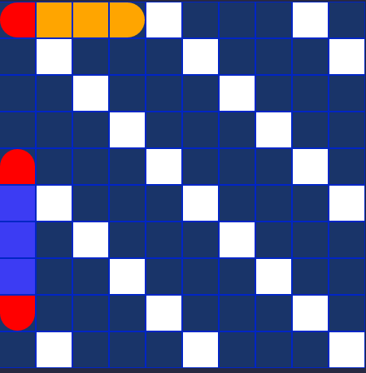
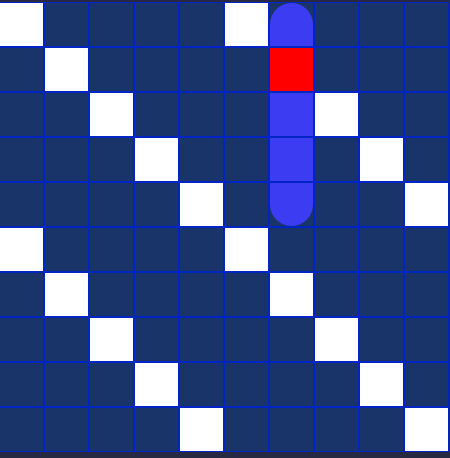

# The computerPlayer.js module: The algorithm that plays as your opponent
## Background: 
<p>I started off building this thinking about how I typically play the game of battleship, which generally has three phases: </p>
<p>&nbsp;&nbsp;&nbsp;&nbsp;&nbsp;&nbsp; 1. Randomly target coordinates on a board until I get a hit. Lets call this phase the “hunting” phase.</p>
<p>&nbsp;&nbsp;&nbsp;&nbsp;&nbsp;&nbsp; 2. Once I get an initial hit, find out the orientation of the ship (that is, is the ship placed horizontally or vertically on the board) by firing around the target. This phase we can call “honing in” </p>
<p>&nbsp;&nbsp;&nbsp;&nbsp;&nbsp;&nbsp; 3. Once I get an orientation for the ship, I fire along that axis until I sink the ship. The “sinking” phase.</p>

  <p>&nbsp;&nbsp;&nbsp;&nbsp;&nbsp;&nbsp;Pretty straightforward right? Well, there are some other things that we want to take into consideration when thinking through this algorithm if we want to make it an effective one-- that is, one that is relatively challenging to beat and mimmicks how humans play the game. </p>

## Phase 1: Hunt for the ship
  <p>&nbsp;&nbsp;&nbsp;&nbsp;&nbsp;&nbsp;The first thing that we might note about phase 1 as stated above is that when we play the game of battleship, we really don’t just fire randomly at a board.  This is because, for one,  humans can’t really think in random patterns anyway, but even if we could, it wouldn't really be an effective strategy for finding a ship. I noticed this after building my first version of this algorithm, which carried out the hunting phase by firing at random coordinates at the board, and in playing against it I beat it easily almost every time. </p>

  <p>&nbsp;&nbsp;&nbsp;&nbsp;&nbsp;&nbsp; I noticed that when I was hunting for a ship, instead of firing randomly at the board, I was distributing my shots more evenly across certain areas and thinking about what ships could fit in what spaces on the board. And this makes sense because I wouldn’t want to, for instance, fire into a single square coordinate surrounded by four occupied coordinates, because the smallest ship is two units in length (and it would therefore be impossible to find a ship in such a square).  Or if I were  looking for a ship that was four squares long, I would want to focus on the areas of the board that have space for that ship rather than indiscriminately firing at any empty square. </p>
  
### The Checkerboard Strategy

<p>&nbsp;&nbsp;&nbsp;&nbsp;&nbsp;&nbsp;One way to effectively carry out phase 1 is to use a “checkerboard” strategy-- firing at every other coordinate on the board. Since every ship has a minimum length of two, every ship will have at least one part on an odd or even square. On a 10x10 board, this means that we can fire at 50 squares to find our ship, rather than 100. </p>


We can go further and make the checkerboard depend the length of the smallest ship. If both of the two-square ships are hit early and the smallest ship is three squares long, the strategy then becomes to fire at every third square. If the smallest ship left is four units long, then we fire at every fourth square. In other words, we want to fire at every nth square where n = the length of the smallest ship.

<p > the smallest ship is 3 squares long, so target every 3rd square</p>

<p >
the smallest ship is 4 squares long, so target every 4th square</p>

<p >
the smallest ship is 5 squares long, so target every 5th square</p>

We can generate a dynamic checkerboard based off of the length of the smallest ship with a nested loop to create a subset of checkerboard coordinates like so:  
```js
const setCheckerBoardCoords = (game) => {
  let checkerBoardCoords = [[], [], [], [], [], [], [], [], [], []]; //2d array to house the new coords
  const shipLength = smallestRemainingShipLength(game); // the smallest ship left to sink

  for (let i = 0; i < 10; i++) {
    const remainder = i % shipLength;
    for (let j = 0; j < 10; j++) {
      if ((j - remainder) % shipLength === 0) {
        checkerBoardCoords[i].push([i, j]);
      }
    }
  }
  return checkerBoardCoords;
};
```
Each position in the new 2d array holds coordinates to target the main board, like this: 

```js
[
  [ [ 0, 0 ], [ 0, 2 ], [ 0, 4 ], [ 0, 6 ], [ 0, 8 ] ],
  [ [ 1, 1 ], [ 1, 3 ], [ 1, 5 ], [ 1, 7 ], [ 1, 9 ] ],
  [ [ 2, 0 ], [ 2, 2 ], [ 2, 4 ], [ 2, 6 ], [ 2, 8 ] ],
  [ [ 3, 1 ], [ 3, 3 ], [ 3, 5 ], [ 3, 7 ], [ 3, 9 ] ],
  [ [ 4, 0 ], [ 4, 2 ], [ 4, 4 ], [ 4, 6 ], [ 4, 8 ] ],
  [ [ 5, 1 ], [ 5, 3 ], [ 5, 5 ], [ 5, 7 ], [ 5, 9 ] ],
  [ [ 6, 0 ], [ 6, 2 ], [ 6, 4 ], [ 6, 6 ], [ 6, 8 ] ],
  [ [ 7, 1 ], [ 7, 3 ], [ 7, 5 ], [ 7, 7 ], [ 7, 9 ] ],
  [ [ 8, 0 ], [ 8, 2 ], [ 8, 4 ], [ 8, 6 ], [ 8, 8 ] ],
  [ [ 9, 1 ], [ 9, 3 ], [ 9, 5 ], [ 9, 7 ], [ 9, 9 ] ]
]
```
We can then fire at this subset of coordinates and greatly increase our likelihood of hitting a ship on any given attempt. 

### Hunting for a ship: 
Here we take the checkerboard 2d array generated above and randomly select coordinates from it. Then, fire at the main board with those coordinates that we got from the checkerboard. If we can't fire there (because it has already been attempted before and contains either a hit or a miss), we'll get an error and call the function again. Once we get a hit, we move to phase 2, which is the "hone in" phase-- trying to find the orientation of the ship. The randomFireCheckerboard() function handles this, and takes as its argument a game factory function instantiated from the gameboard.js module.


```js
const randomFireCheckerboard = (game) => {

  const checkerBoardCoords = setCheckerBoardCoords(game)
  const row = Math.floor(Math.random() * 10);
  const col = Math.floor(Math.random() * checkerBoardCoords[0].length);
  const target = checkerBoardCoords[row][col]

  try {
    const res = game.fire(target[0], target[1]);
    move = { res: res, board: game.getBoard() };
    if (Array.isArray(res)) {
      //it's a hit, add to hitArray and note surrounding squares. This moves the algorithm into phase two, 
      //which will be talked about below
      hitArray.push([target[0], target[1]]);
      generateSurroundingSquares(target[0], target[1]); // generates the surrounding squares for the hone in phase.
    }
  } catch {
    //if error is returned, try again
    randomFireCheckerboard(game);
  }
};

```


## Phases 2 and 3: Hone In and Sink

So what happens in phases 2 and 3? Remember that "honing in" means that we've hit one square, and are looking to hit an adjacent square to find an orientation for the ship. In the sinking phase, we've gotten an orientation, and are firing along an axis, trying to sink the ship. Ideally, these are the steps: 

  **Hone In**
  
  1. Calculate the coordinates of the four surrounding squares of the first hit target
  2. Randomly fire at those coordinates until we get another hit
  3. Once another square is hit, determine an orientation (vertical or horizontal)
  
  **Sink**
  
  4.   Fire along a given axis until we get a sunk ship
 

However, ships can be placed next to each other in various ways, which means that: 
  - getting a sunk ship does not always mean that this phase is finished. 
  - we may not even get a sunk ship if two ships are placed parallel to each other. 
  
Consider the following examples: 

1. 
2. 

- In example 1, we had seemingly found an axis, but upon not sinking anything, a human would realize that there are three parallel ships to attack, and that the three hit points are actually  _each_ a starting point for the hone in phase. 
- In example 2, we _do_ get a sunk ship, but there is an extra hit square that hasn't been sunk. Again, a human would realize that this is another ship to hone in on.

## Using a stack to manage the attack
A straightforward way to handle this is to use stacks to make sure that we are sinking all of the ships that we hit. We'll start off with two empty arrays, hitArray and targetStack: 
```js
let targetStack = [];
let hitArray = []; 
```
### Managing phases with hitArray and targetStack

<p>The contents (or lack thereof) of the hitArray and the targetStack will determine what phase the algorithm is in, and what the algorithm should do.</p>

#### Hunting Phase
- If there is nothing in either the hitArray or the targetStack, we are in the "hunting" phase and trying to find a ship. After we hit a ship, we push the hit coordinates to the hitArray.

#### hitArray
- The hitArray keeps track of the current ship being targeted, and is responsible for the attack on a single ship. If there is only one coordinate in this array, we are in the "hone in" phase and attack the surrounding squares. 
- If there are multiple coordinates in the hitArray, we are in the "sink" phase-- we have an orientation and attack along an axis.
- The attack ends with either receiving a "sunk" response from the game (i.e. sinking a ship), or if no ship has been sunk and we can't continue firing along that axis (this means that the ships are parallel). 
- If after the attack there are still coordinates in the hitArray that have not been sunk, those are pushed to the targetStack, and the hitArray is cleared. A new hone in phase is started for each of the coordinates in the stack by shifting each coordinate to the hitArray in turn. 
#### targetStack
- The targetStack keeps track of any hit targets that have not been sunk. If the hitArray is empty and there is something in the target stack, we shift the first coordinate from the targetStack into the hitArray.

#### So, To Summarize:
At the beginning of every call to the computer player, it will check first-- is there anything in the hitArray?
- if there is one sole coordinate in the hit array, a ship has been hit, but an orientation has not be determined. Attack the surrounding squares.
- if there are two or more things in the hit array, an orientation has been determined and the algorithm will attack along an axis
- if there is nothing in the hit array, the target stack is checked for contents
- if there is something in the target stack && it is not a part of a sunk ship, shift the first coordinate to the hitArray and start the hone in phase for that coordinate
- if there is something in the target stack && it is a part of a sunk ship, remove it from the target stack and move to the next coordinate in the target stack, if there is one
- if there is nothing in the target stack && nothing in the hitArray, the algorithm is in the hunting phase and randomly selects a checkerboard coordinate to use to fire at the main board. Once a ship is hit, it pushes those coordinates to the hitArray


## The Computer Player Module
The computer player is in its own module of functions, which are controlled by the function computerPlayer(), the default exported function.  computerPlayer() takes as its arguments a game function that is created from the code in the gameboard.js module, with which it interacts, and a mode to set the difficulty level.  Each function that computerPlayer() controller function calls will trigger a move, and the computerPlayer function itself returns the updated game state and the current board.  This can be used by the front end to update the display. The move is set by the functions that computerPlayer() calls, like so: 
```js
move = { res: res, board: game.getBoard() } 
```
 In easy mode the algorithm does not implement the checkerboard strategy, and the strategy that is implemented is controlled by the hunt() method: 

```js
const hunt = (game) =>{
  if(difficulty==="easy") randomFire(game)
  if(difficulty ==="hard") randomFireCheckerboard(game)
}
```
The process of phases illustrated previously of hunt, hone in, and sink is controlled by the computerPlayer() function. 
```js
const computerPlayer = (game, mode) => {
  difficulty = mode
  if (hitArray.length === 0) {
    // not currently attacking any ship
    if (targetStack.length === 0) {
      //no previous hit targets to add to attack
      hunt(game)
      return move;
    } else if (targetStack.length !== 0) {
      manageTargetStack(game); //takes a target from the stack and sends it to hit array if appropriate.
      return move;
    }
  }
  if (hitArray.length === 1) {
    // hone in mode: trying to find an orientation
    honeIn(game);
    return move;
  }
  if (hitArray.length > 1) {
    //sink mode: we have an orientation and are firing along an axis
    sinkShip(game);
    return move;
  }
};
```


